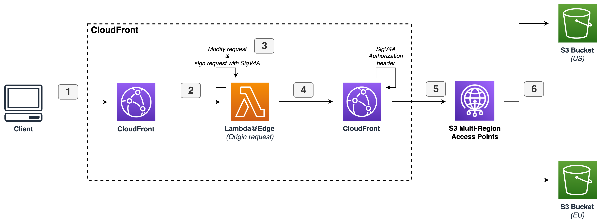

# How to use Amazon S3 Multi-Region Access Points with Amazon CloudFront to build active-active latency-based applications

Many AWS customers are looking to optimize the performance of their applications which will deliver best possible
experience to their end-users. Furthermore, architect the applications for disaster events,
which is one of the biggest challenges they can face. In this post, you will learn how to use
[Amazon S3 Multi-Region Access Points](https://aws.amazon.com/s3/features/multi-region-access-points/)
with [Amazon CloudFront](https://aws.amazon.com/cloudfront) to serve your web applications, static assets,
or any objects stored in your [Amazon Simple Storage Service (Amazon S3)](https://aws.amazon.com/s3/) in a
[Multi-Region Active-Active](https://aws.amazon.com/blogs/architecture/disaster-recovery-dr-architecture-on-aws-part-iv-multi-site-active-active/)
setup that provides latency-based routing so that content is delivered with the lowest network latency.

## Solutions Architecture



## Deployment and implementation details

### Prerequisites

- AWS Account with sufficient [AWS Identity and Access Management (IAM)](https://aws.amazon.com/iam/)
  permissions to create [Amazon CloudFront distribution](https://docs.aws.amazon.com/AmazonCloudFront/latest/DeveloperGuide/distribution-working-with.html),
  Lambda function and S3 Multi-Region Access Point.

- Two Amazon S3 buckets in same AWS Account, that will be added to the S3 Multi-Region Access Point.
  The Amazon S3 buckets must be in one of
  [AWS Regions supported by S3 Multi-Region Access Point](https://docs.aws.amazon.com/AmazonS3/latest/userguide/MultiRegionAccessPointRestrictions.html).

- The [AWS Command Line Interface (CLI)](https://aws.amazon.com/cli/) installed and
  [configured for use](https://docs.aws.amazon.com/cli/latest/userguide/cli-chap-configure.html),
  to deploy the CloudFormation template.

- [Python 3.8](https://www.python.org/downloads/) or later and
  [pip package installer](https://pip.pypa.io/en/stable/), to package Python code for Lambda.
    - Note: I recommend that you use a
      [virtual environment](https://packaging.python.org/guides/installing-using-pip-and-virtual-environments/) or
      [virtualenvwrapper](https://virtualenvwrapper.readthedocs.io/en/latest/)
      to isolate the solution from the rest of your Python environment.

- This GitHub repository for the solution. You can
  [download it](https://gitlab.aws.dev/lovaarte/cloudfront-with-s3-multi-region-access-points/-/archive/main/cloudfront-with-s3-multi-region-access-points-main.zip),
  or you can use the following [Git](https://git-scm.com/) command to clone the repository from your terminal.

- [cURL](https://curl.se/) command-line tool to make an HTTP request.
  Usually cURL comes pre-installed on modern operating systems.

### Packaging Lambda function

From within project root folder, open the `lambda` folder.

```shell
cd ./lambda
```

Install Python dependencies for the Lambda function.

```shell
# If you see an error that pip isn't found, try with "pip3".
pip install \
  --platform manylinux1_x86_64 \
  --only-binary=:all: \
  -t package/ -r ./requirements.txt
```

Create deployment package using Lambda function `lambda_function.py` and `package` folder.

```shell
cd package
zip -r ../deployment-package.zip .
cd ..
zip -g deployment-package.zip lambda_function.py
```

You now should have `deployment-package.zip` file inside the `lambda` folder.
Run the next command to upload the deployment package to your Amazon S3 bucket `S3_BUCKET_ONE_NAME`.

Provide the Amazon S3 bucket names for variables `S3_BUCKET_ONE_NAME` by replacing
the placeholder `<BUCKET-ONE-NAME-HERE>` with your S3 bucket name.

```shell
S3_BUCKET_ONE_NAME="<BUCKET-ONE-NAME-HERE>"
aws s3 cp ./deployment-package.zip s3://${S3_BUCKET_ONE_NAME}/lambdapackage/deployment-package.zip
```

### Deploying CloudFormation stack

Since you’re still inside the lambda folder, first cd into the parent folder.

```shell
cd ..
```

Provide the Amazon S3 bucket names for variables `S3_BUCKET_ONE_NAME` and `S3_BUCKET_TWO_NAME` by replacing
the placeholder `<BUCKET-ONE-NAME-HERE>` and `<BUCKET-TWO-NAME-HERE>` with your S3 bucket names.
Deploy the CloudFormation stack by run the following command below.

`Note`: `S3_BUCKET_ONE_NAME` and `S3_BUCKET_TWO_NAME` are the two Amazon S3 buckets that already exists in your account as highlighted in prerequisites.

```shell
CF_STACK_NAME="cloudfront-s3-mrap-demo"
CF_TEMPLATE_FILE_PATH="./cloudformation.template"
S3_BUCKET_ONE_NAME="<BUCKET-ONE-NAME-HERE>"
S3_BUCKET_TWO_NAME="<BUCKET-TWO-NAME-HERE>"

STACK_ID=$(aws cloudformation create-stack \
    --stack-name ${CF_STACK_NAME} \
    --template-body ${CF_TEMPLATE_FILE_PATH} \
    --parameters ParameterKey=S3BucketOneName,ParameterValue=${S3_BUCKET_ONE_NAME} ParameterKey=S3BucketTwoName,ParameterValue=${S3_BUCKET_TWO_NAME} \
    --query 'StackId' --output text)
```

`Optional`: You can wait for stack creation. When the command completes, it's a signal stack creation is completed.

```shell
aws cloudformation wait stack-create-complete \
  --stack-name ${STACK_ID}
```

## Testing the deployment

Before you start testing the deployed solution, you first need to upload a file to each of the
Amazon S3 buckets that are associated with the S3 Multi-Region Access Points.

`Note`: For testing purposes you are going to upload the file to each S3 bucket separately.
For a production configuration I recommend to use replication rules inside the S3 Multi-Region Access Points
to synchronize data among buckets. To learn more, see Configuring bucket replication for use with
[Multi-Region Access Points](https://docs.aws.amazon.com/AmazonS3/latest/userguide/MultiRegionAccessPointBucketReplication.html).
Alternatively, you can use Amazon S3 replication inside the S3 bucket configuration directly.
To learn more, see [Amazon S3 Replication](https://aws.amazon.com/s3/features/replication/).

### Upload file to Amazon S3 buckets

Upload an `index.html` file into the first S3 bucket.

```shell
CF_STACK_NAME="cloudfront-s3-mrap-demo"
S3_BUCKET_ONE_NAME=($(aws cloudformation describe-stacks \
      --stack-name ${CF_STACK_NAME} \
      --query "Stacks[0].Outputs[?OutputKey=='S3BucketOneName'].OutputValue" --output text \
      --output text))

BLOB="hello from s3 bucket ${S3_BUCKET_ONE_NAME}"
echo "${BLOB}" | aws s3 cp - s3://${S3_BUCKET_ONE_NAME}/index.html
```

Upload an `index.html` file into the second S3 bucket.

```shell
CF_STACK_NAME="cloudfront-s3-mrap-demo"
S3_BUCKET_TWO_NAME=($(aws cloudformation describe-stacks \
      --stack-name ${CF_STACK_NAME} \
      --query "Stacks[0].Outputs[?OutputKey=='S3BucketTwoName'].OutputValue" --output text \
      --output text))

BLOB="hello from s3 bucket ${S3_BUCKET_TWO_NAME}"
echo "${BLOB}" | aws s3 cp - s3://${S3_BUCKET_TWO_NAME}/index.html
```

### Lookup CloudFront distribution DNS

Next, look up the CloudFront distribution DNS and export as environment variable.

```shell
CF_STACK_NAME="cloudfront-s3-mrap-demo"
CLOUD_FRONT_DNS=($(aws cloudformation describe-stacks \
      --stack-name ${CF_STACK_NAME} \
      --query "Stacks[0].Outputs[?OutputKey=='CloudFrontDns'].OutputValue" --output text \
      --output text))

export CLOUD_FRONT_DNS="${CLOUD_FRONT_DNS}"
```

## Failover

For failover to work correctly, it’s important to Lambda function to distinguish if it’s a normal request to the
origin, a request you want to modify, and a failover request, where you don’t want to modify the request.
If it’s a failover request, it means the initial normal request didn’t succeed and there is no need
to modify the request again, and the result most likely will be the same. For the failover case,
you return the unmodified request object back to CloudFront and let the failover origin handle the request.

### CloudFront custom headers

The way it’s achieved is by adding a custom header to your chosen failover origin.
That header is expected to match with the value assigned to the `failover_header` variable.
The check is made with the `if` statement to identify if it’s the failover request.
If this is the case, request is return to CloudFront before the code that modifies the request object,
therefore the request remain unmodified.

### Dynamically derived

In case your failover origin is not yet another S3 Multi-Region Access Point, you can dynamically
identify if it's the request to the failover region by looking at the `domainName` in the request object.
S3 Multi-Region Access Point has a very distinct domain name, and you could pattern match if it's any other
domain name but the S3 Multi-Region Access Point one. With this, you remove the need defining
custom header in your failover origin.

## Cleanup

After you’ve tested the solution, you can clean up all the created AWS resources by deleting the CloudFormation stack.

```shell
CF_STACK_NAME="cloudfront-s3-mrap-demo"
aws cloudformation delete-stack --stack-name ${CF_STACK_NAME}
```

Delete the `deployment-package.zip` file from Amazon S3 bucket `S3_BUCKET_ONE_NAME`
and the `index.html` from Amazon S3 buckets `S3_BUCKET_ONE_NAME` and `S3_BUCKET_TWO_NAME`.

Provide the Amazon S3 bucket names for variables `S3_BUCKET_ONE_NAME` and `S3_BUCKET_TWO_NAME` by replacing
the placeholder `<BUCKET-ONE-NAME-HERE>` and `<BUCKET-TWO-NAME-HERE>` with your S3 bucket names.

```shell
S3_BUCKET_ONE_NAME="<BUCKET-ONE-NAME-HERE>"
S3_BUCKET_TWO_NAME="<BUCKET-TWO-NAME-HERE>"

aws s3 rm s3://${S3_BUCKET_ONE_NAME}/lambdapackage/deployment-package.zip
aws s3 rm s3://${S3_BUCKET_ONE_NAME}/index.html
aws s3 rm s3://${S3_BUCKET_TWO_NAME}/index.html
```


## Security

See [CONTRIBUTING](CONTRIBUTING.md#security-issue-notifications) for more information.

## License

This library is licensed under the MIT-0 License. See the LICENSE file.

